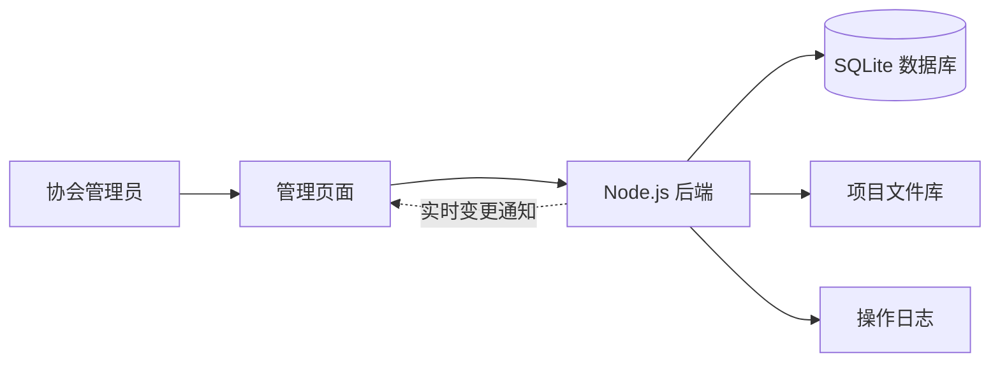

# 团体标准管理系统设计

## 设计目标

系统按“一个工作台、一个项目入口、一个办理页面”组织日常操作。管理员不需要理解数据库：新建项目后直接进入流程，完成当前环节只需一次点击，材料缺失时在同一页面上传，系统自动更新状态并记录操作。

## 系统结构

第一阶段采用单体部署，安装、备份和恢复都比较简单。将来多人并发增加时，可以保持页面和接口不变，把 SQLite 平滑迁移到 PostgreSQL，把文件迁移到对象存储。

## 页面操作

| 页面 | 常用操作 | 系统自动完成 |
|---|---|---|
| 工作台 | 查看重点项目和待办 | 汇总进度、缺件和项目数量 |
| 数据看板 | 查看趋势、构成、流程热力 | 实时计算重要指标和材料完整率 |
| 项目台账 | 新建、搜索、修改、办理、上传和查看档案 | 保存数据库并按项目及流程节点组织材料 |
| 历史台账 | 检索、修改、导出、关联项目 | 保存 Excel 原表字段并保护敏感信息 |
| 流程办理 | 完成当前环节、审核退回 | 更新环节、项目状态和办理记录 |
| 待补材料 | 上传、忽略、重新打开 | 文件归档、状态更新和日志留痕 |
| 标准化体系 | 完成或添加建设任务 | 保存任务状态 |

## 数据库

| 数据表 | 用途 | 关键内容 |
|---|---|---|
| `users` | 系统用户 | 账号、加密密码、角色 |
| `sessions` | 登录会话 | 会话令牌、到期时间 |
| `projects` | 项目主台账 | 名称、编号、单位、环节、状态、期限 |
| `missing_items` | 待补材料 | 所属项目、环节、材料、处理状态 |
| `documents` | 项目档案 | 原文件名、存储名、大小、上传人 |
| `activities` | 办理留痕 | 项目、动作、操作人、结果、时间 |
| `roadmap_items` | 体系建设任务 | 任务、责任人、计划时间、完成状态 |
| `published_standards` | 已发布标准库 | 标准编号、名称、年份 |
| `ledger_imports` | Excel 导入批次 | 来源文件、哈希、导入时间和数量 |
| `ledger_records` | 历史项目台账 | 项目进展、委托方、联系人、费用、合同路径 |
| `ledger_published` | 原表发布记录 | 编号、名称、发布单位和日期 |
| `annual_plans` | 年度立项计划 | 年份、标准名称和原表行号 |

数据库启用外键约束和 WAL 日志模式。密码通过 scrypt 加盐保存；登录令牌只以哈希形式写入数据库。

## 后端接口

- `POST /api/login`、`POST /api/logout`：登录和退出
- `POST /api/account/password`：修改密码并注销其他会话
- `GET /api/bootstrap`：一次取得页面所需的全部数据
- `GET /api/events`：保持登录态下的实时同步连接，数据变化后通知其他页面刷新
- `POST /api/users`、`PATCH /api/users/:id`：用户和角色管理
- `POST /api/projects`、`PUT /api/projects/:id`：新建和修改项目
- `POST /api/projects/:id/advance`：完成当前环节
- `POST /api/projects/:id/return`：审核退回
- `POST /api/projects/:id/archive`：归档或恢复项目
- `POST /api/projects/:id/documents`：按流程节点归档文件
- `GET /api/documents/:id/preview`：安全预览 PDF、图片和文本等浏览器支持格式
- `PUT /api/ledger/:id`：维护历史 Excel 台账
- `POST /api/ledger/:id/promote`：关联或转入正式项目台账
- `PATCH /api/missing/:id`：更新待补材料状态
- `POST /api/missing/:id/upload`：上传并归档材料
- `GET /api/documents/:id/download`：下载项目文件
- `POST /api/roadmap`、`PATCH /api/roadmap/:id`：维护体系任务
- `POST /api/backups`、`GET /api/backups/:id/database`：创建和下载备份

所有写操作均由后端校验，并以当前登录用户记录操作日志。写入成功后，后端通过 Server-Sent Events 通知所有已登录页面重新读取统一数据库；连接中断时浏览器会自动重连。

## 数据备份与安全

- 页面和接口由同一个域名提供，避免跨域和凭据泄露。
- 正式环境必须设置强 `ADMIN_PASSWORD` 并使用 HTTPS。
- 系统、数据库和上传目录统一放在 `D:\团体标准管理系统`。
- 系统每天自动备份数据库与附件，并保留最近 30 份。
- 初始密码必须在首次登录后修改；密码变更后会注销其他会话。
- 历史台账中的联系人、合同和费用字段只向管理员和经办人返回。
- 原始 Word、PDF、合同和专家信息不应提交到公开 GitHub 仓库。
- 用户通过系统上传、预览和下载材料，不需要直接操作磁盘文件夹；Word、Excel 等不适合浏览器内显示的格式仅提供下载。

## 后续扩展

下一阶段可增加 Excel 自助上传解析、材料模板、消息提醒和标准复审；再后续接入协会统一身份认证、PostgreSQL、对象存储和全文检索。现有接口按资源划分，升级时无需重新设计页面。
